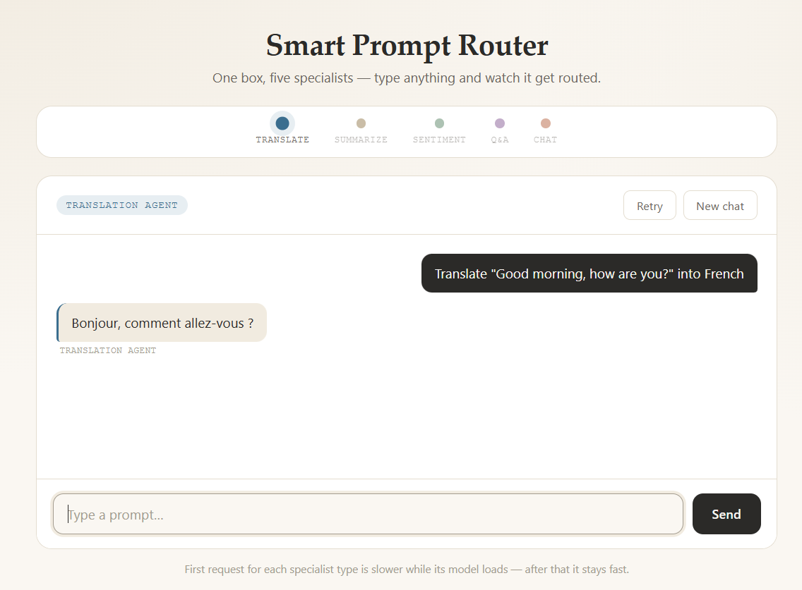
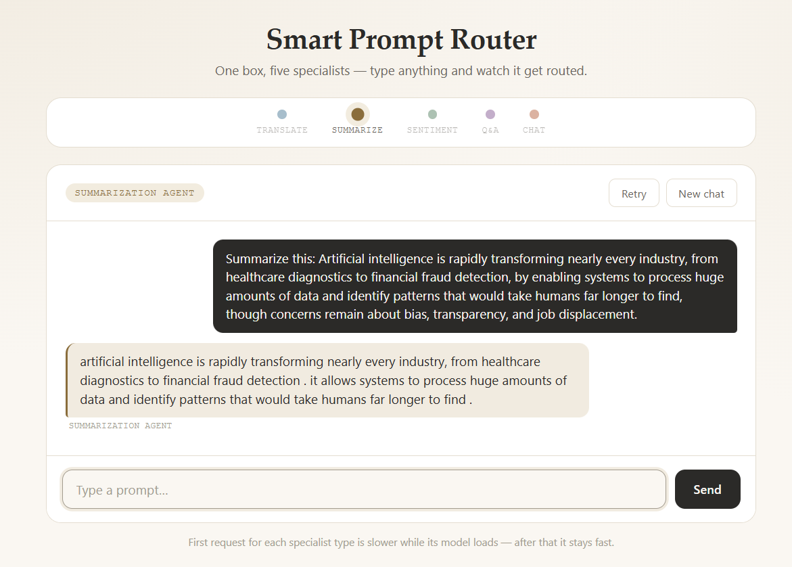
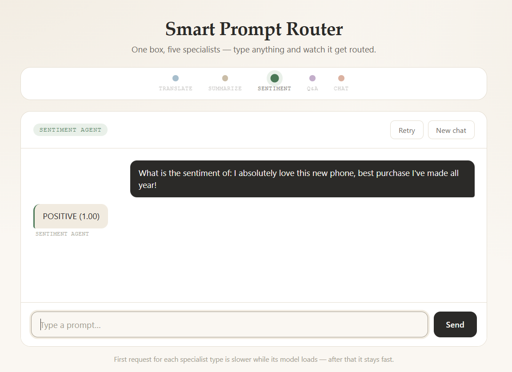
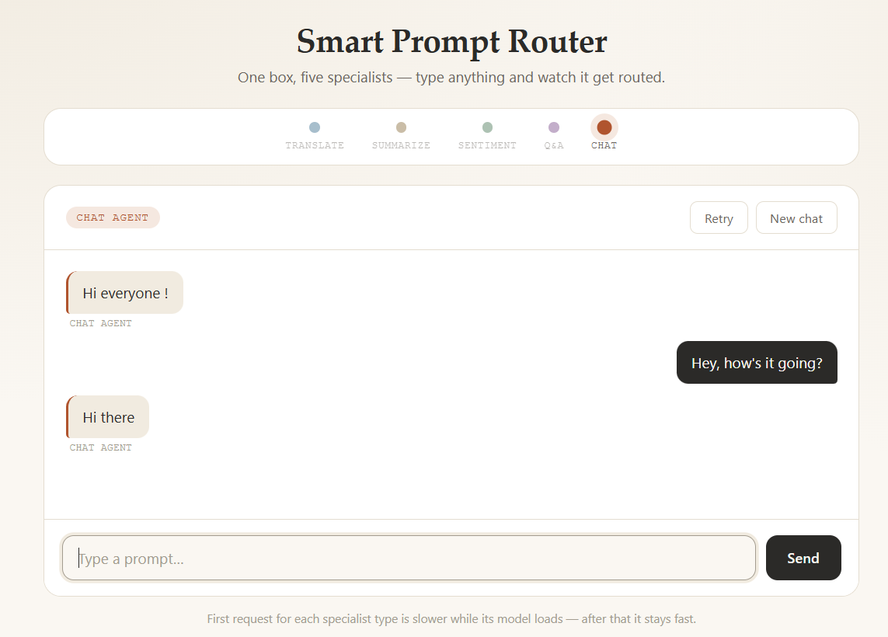
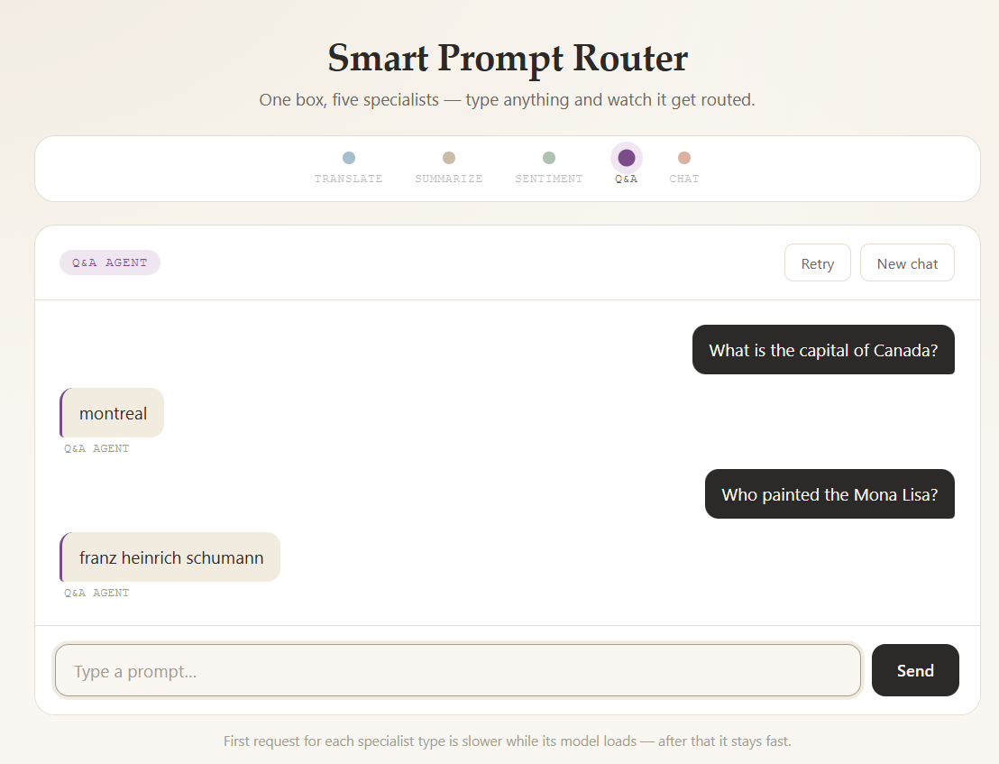

# Smart Prompt Routing System

A mini agent that reads a user's prompt, figures out what they actually want
(translate, summarize, check sentiment, answer a question, or just chat), and
routes it to a small specialized HuggingFace model that handles that task
all behind a simple web chat interface.

```
User Prompt → Intent Classifier → Router → Specialized Model → Response
            (TF-IDF + Logistic       (router.py)   (5 HuggingFace models)
             Regression)
```

## How it works, end to end

1. The person types a prompt into the chat box.
2. The prompt is sent to a small **intent classifier** (TF-IDF + Logistic
   Regression, trained on 599 labeled examples) that predicts one of 5 labels:
   `translation`, `summarization`, `sentiment`, `qa`, or `chat`.
3. The **router** (`app/routers/router.py`) looks up which specialized
   HuggingFace model handles that label and calls it.
4. The model's output is returned to the browser, tagged with which agent
   answered, and the routing strip in the UI lights up to show the path the
   prompt took.
5. For `chat`, a per-session conversation history is kept so follow-up
   messages have context, like a real back-and-forth.

This is the same idea as a real-world "mixture of experts" or a customer
support triage system: one cheap, fast classifier decides who should handle
a request, instead of one giant model trying to do everything.

## Project structure

```
Smart Prompt Routing System/
├── app/                          # the FastAPI web app
│   ├── config/
│   │   └── config.py             # WEIGHTS_PATH, resolved relative to this file
│   ├── model/
│   │   ├── intent_classifier.pkl     # TF-IDF + LogisticRegression pipeline
│   │   └── label_encoder.pkl         # maps class ids <-> intent names
│   ├── routers/
│   │   ├── router.py             # core routing logic + the 5 HF models
│   │   └── agents.py             # FastAPI routes: /agents/ask, /agents/reset
│   ├── static/
│   │   ├── css/style.css         # light "paper" theme, one accent color per agent
│   │   └── templates/index.html  # single persistent chat panel
│   ├── util/                     # reserved for future helpers (currently empty)
│   ├── __init__.py
│   └── main.py                   # FastAPI app entrypoint
├── Data/
│   └── prompts-intents.csv       # 599 labeled training prompts
├── Notebook/
│   └── smart-prompt-routing-system.ipynb          # full training & evaluation walkthrough
├── screenshots/                  # example runs of the app (see Screenshots section)
├── venv/                         # local virtual environment (not committed)
├── requirements.txt
└── README.md                     # this file
```

> The notebook and CSV live in their own top-level folders (`Notebook/`, `Data/`)
> rather than next to `app/` — if you move either one, just update the `PATH`
> variable at the top of the notebook to point at the new CSV location.

## The dataset

`Data/prompts-intents.csv` — **599 labeled prompts**, roughly balanced across
5 intents:

| Intent | Count | Example |
|---|---|---|
| `chat` | 120 | "Hey, how are you doing today?" |
| `qa` | 120 | "What is the capital of Australia?" |
| `translation` | 120 | "Translate 'Hello, how are you?' into Spanish." |
| `sentiment` | 120 | "Is the following review positive or negative: ..." |
| `summarization` | 119 | "Summarize the main points of the article provided below." |

Two columns: `prompt` (the raw text) and `intent` (the label).

## Training the intent classifier

Full walkthrough is in `Notebook/mini_agent.ipynb`. Summary of the approach:

1. **Split**: 70% train / 15% validation / 15% test, stratified so each split
   keeps the same class balance. The test set is touched exactly once, at the
   very end, for an honest performance number.
2. **Model selection**: compared TF-IDF + Logistic Regression against Linear
   SVM and Naive Bayes using 5-fold cross-validation on the training set only.
   Logistic Regression came out on top.
3. **Hyperparameter tuning**: grid search over TF-IDF settings (n-gram range,
   max features) and the regression's regularization strength `C`, scored by
   5-fold CV macro-F1.
4. **Final fit**: best configuration refit on train+validation combined, then
   evaluated once on the untouched test set.
5. **Result**: **~95–96% test accuracy / macro-F1** on the 90-example held-out
   test set. The confusion matrix (in the notebook) shows the small amount of
   confusion that exists is mostly between `sentiment` and `qa`/`summarization`
   — prompts that mix an opinion with a question about a passage can look
   lexically similar to a bag-of-words model.
6. **Artifacts saved**: `intent_classifier.pkl` (the full TF-IDF + Logistic
   Regression pipeline) and `label_encoder.pkl` (maps the 5 string labels to
   the integer ids the classifier predicts). Both get copied into `app/model/`
   for the live app to load.

This is intentionally a simple, fast, CPU-only classifier, it doesn't need
a GPU or a large model, since intent classification on short prompts is an
easy task for even a linear model once it has enough labeled examples.

## The specialized models

| Intent | Model | Why this one |
|---|---|---|
| `translation` | `Helsinki-NLP/opus-mt-en-fr` | A dedicated English→French MarianMT model, small, fast, accurate for direct translation. |
| `summarization` | `google-t5/t5-base` | Upgraded from `t5-small`, which was too weak: it echoed short paragraphs back almost verbatim and degenerated into gibberish on longer ones. `t5-base` actually compresses text. |
| `sentiment` | `distilbert-base-uncased-finetuned-sst-2-english` | A DistilBERT model fine-tuned specifically for positive/negative sentiment, small and reliable for this narrow task. |
| `qa` | `microsoft/Phi-4-mini-instruct` | Went through two earlier models first: `flan-t5-small`, then `flan-t5-base`, both were too small to reliably recall facts and answered confidently but wrong (see [Known limitations](#known-limitations) and the Q&A screenshot below). Phi-4-mini-instruct (3.8B, MIT license) is a modern instruction-tuned model with much stronger factual recall, while still running on CPU without a GPU. |
| `chat` | `microsoft/Phi-4-mini-instruct` | Replaces `DialoGPT-small` (a 2019-era model with no instruction-following, prone to echoing the prompt back). Shares the same loaded model as `qa`, cached once, used for both — with full per-session conversation history passed through its real chat template for proper multi-turn context. |

`qa` and `chat` share the same loaded model in memory (cached once, used with
different prompting), so the app effectively loads 4 distinct models total,
not 5.

All models are loaded **lazily**, only when their intent is first used so
the server starts instantly instead of downloading everything before it can
answer anything. Once loaded, each model stays cached in memory for the rest
of the server's run.

**Translation and summarization** are loaded with `AutoTokenizer` +
`AutoModelForSeq2SeqLM` and called via `.generate()` directly, rather than
`pipeline()`. This is a deliberate choice: newer `transformers` releases
(v5+) removed the `"translation"` and `"summarization"` task names from the
pipeline registry, so `pipeline("translation", ...)` etc. raise a `KeyError`
on those versions. Calling `.generate()` directly works the same way
regardless of `transformers` version. Sentiment still uses `pipeline()`
since `"text-classification"` remains a registered task either way. Chat and
QA use -4-mini-instruct's chat template (`tokenizer.apply_chat_template`)
rather than `pipeline()` or raw `.generate()`, since that's the model's
intended interface for instruction-following.

**Translation** also strips instruction wrappers before calling the model

## The web app

A single FastAPI app (`app/main.py`) serving one page (`app/static/templates/index.html`):

- **Routing strip** : five dots, one per agent, with the matching one lighting
  up in that agent's accent color each time a prompt is classified.
- **One persistent conversation panel** : no separate screen per intent. You
  can ask a translation, then a question, then chat, all in the same
  continuous thread, scrolling back through the full history.
- **Session id** : generated per page load, sent with every request, so the
  `chat` agent's conversation history persists across turns ("What's my
  name?" works if you told it earlier in the same session).
- **New chat** : clears the conversation (both client-side and the server-side
  chat history via `POST /agents/reset`).
- **Retry** : resends the last message.
- Light "paper" color theme with a distinct accent color per agent
  (translation = blue, summarization = amber, sentiment = green, qa = purple,
  chat = terracotta), used consistently across the routing strip, the agent
  tag, and each reply's left border.

## Setup & running it

You need an internet connection the first time you run the app; the 5
HuggingFace models (roughly 1GB combined with the `-base` upgrades) are
downloaded and cached locally on first use of each intent.

```bash
# from the project root (the folder containing app/)
python -m venv venv
venv\Scripts\activate        # for Windows

pip install -r requirements.txt
```

Run it:

```bash
python -m app.main
```

Then open **http://127.0.0.1:8000** in your browser.

> First request for each intent will be slow (downloading + loading that
> model). After that it's cached in memory and stays fast for the rest of
> the session.

## Retraining the classifier

Open `Notebook/smart-prompt-routing-system.ipynb`, update the `PATH` variable in section 2 if
your CSV lives somewhere else, and run all cells. It regenerates
`intent_classifier.pkl` and `label_encoder.pkl` copy both into
`app/model/` to update the live app.

**Important:** train and run the app with the same `scikit-learn` version
(this project pins `scikit-learn==1.8.0`) pickled sklearn pipelines aren't
guaranteed to load correctly across major/minor version differences.

Swapping which HuggingFace model handles an intent (e.g. `flan-t5-base` →
`Phi-4-mini-instruct`, as happened for `qa` and `chat`) does **not** require
retraining the classifier the classifier only decides *which* specialist
handles a prompt; it has no dependency on which model that specialist calls.

## Current limitations

- **Phi-4-mini-instruct is heavier.** At ~8GB for its bf16 weights, it needs
  more RAM/disk than the small models used before, and is slower per request
  on CPU (no GPU required, but expect noticeably longer generation times than
  the original `flan-t5`/`DialoGPT` setup).
- **Q&A can still be wrong on very obscure or recent facts.** Phi-4-mini-instruct
  is far stronger than `flan-t5-base`, but it's still a "mini" model with a
  training cutoff — don't expect perfect recall on niche trivia or anything
  past its training data.
- **Chat history is capped** at roughly 1024 tokens per session (older turns
  get dropped first) to keep generation fast — very long conversations will
  eventually "forget" their earliest messages.
- **Summarization can still struggle on unusual text.** `t5-base` is a solid
  step up from `t5-small`, but on very short, very long, or unusually
  structured text it can occasionally under-compress. `gen_summary` detects
  this (output not actually shorter than the input, too short, or mostly
  repeated words) and falls back to a sentence-aware truncation of the
  original text so the user always gets something readable rather than
  garbage.
- **The classifier's main confusion** is between `sentiment` and
  `qa`/`summarization` prompts that mix an opinion with a question about a
  passage. More labeled examples for those classes would help most if you
  want to push classifier accuracy even higher than the current ~95–96%.
- If a specialized model fails to load entirely (e.g. no internet on first
  run), the router falls back to the `chat` handler so the user still gets
  *some* response instead of a server error.

## Screenshots

Example runs of the app, one per agent. Image files live in `screenshots/`.

### Translation agent

`Translate "Good morning, how are you?" into French` → correctly strips the
instruction wrapper and returns just the translated sentence.



### Summarization agent

A multi-sentence paragraph about AI condensed down to its key points.



### Sentiment agent

A clearly positive review correctly classified with a high confidence score.



### Chat agent

A short back-and-forth greeting, routed correctly to the chat specialist.



### Q&A agent : illustrates the limitation above

This run is from the **`flan-t5-base` version** of the `qa` model (since
upgraded to `Phi-4-mini-instruct` see
[Known limitations](#known-limitations)). It's kept here deliberately: it's
a clear example of confident-but-wrong output ("Montreal" is not the capital
of Canada; "Franz Heinrich Schumann" did not paint the Mona Lisa) — the exact
failure mode that motivated the upgrade.


